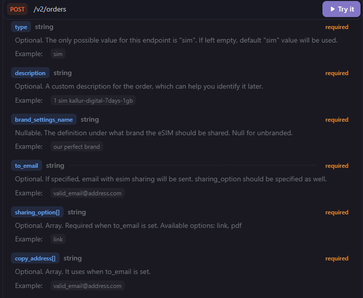

# winds-of-change

## Table of Contents

- [Installation](#installation)
  - [Prerequisites](#prerequisites)
- [Configuration](#configuration)
  - [Environment Variables](#environment-variables)
  - [Enable or Disable Response Schema Validation](#enable-or-disable-response-schema-validation)
  - [Headless Mode](#headless-mode)
  - [Selecting Website Locale and Currency for End-to-End Tests](#selecting-website-locale-and-currency-for-end-to-end-tests)
- [Running Tests](#running-tests)
- [Features](#features)
  - [Custom Matcher](#custom-matcher)
  - [API Methods Types](#api-methods-types)
  - [API Client with Automatic Token Refresh](#api-client-with-automatic-token-refresh)
- [Notes](#notes)
  - [Typescript Version](#typescript-version)
  - [API Documentation Inconsistencies](#api-documentation-inconsistencies)
    - [Place Order / Submit Order `POST /v2/orders` request](#place-order--submit-order-post-v2orders-request)
    - [Place Order / Submit Order `POST /v2/orders` response](#place-order--submit-order-post-v2orders-response)
    - [Get SIM Details `GET /v2/sims/{iccid}` request](#get-sim-details-get-v2simsiccid-request)
    - [Website Behavior](#website-behavior)
- [Possible Improvements](#possible-improvements)
- [Test Advisory](#test-advisory)
- [Troubleshooting](#troubleshooting)

## Installation

### Prerequisites

- Node.js 22+
- npm 10+

To install the project, run the following commands:

```bash
npm install
npx playwright install
```

## Configuration

### Environment Variables

The project uses `dotenv` to manage environment variables. Please copy the `.env.example` file to `.env` and fill in the required values before running the tests.

List of environment variables:

- `API_BASE_URL`: The base URL of the API to test against.
- `E2E_BASE_URL`: The base URL of the web application to test against in end-to-end tests.
- `CLIENT_ID`: Your API CLIENT_ID for authentication.
- `CLIENT_SECRET`: Your API CLIENT_SECRET for authentication.

### Headless Mode

The test suite runs in headless mode by default. To run with a visible browser window, set `HEADLESS=false` in the `.env` file.

### Enable or Disable Response Schema Validation

In `playwright.config.ts`, there is a `validateResponseSchema` fixture option that can be set to `error`, `warn`, or `off`.

- `error`: The matcher will throw and the test will fail if the API responses do not match the JSON schemas defined in the OpenAPI specification.
- `warn`: The matcher will add an annotation to the test report if the API responses do not match the JSON schemas, but the test will still pass.
- `off`: The matcher will not perform any schema validation, allowing the tests to pass regardless of whether the API responses match the JSON schemas or not.

This validation of API responses runs against the JSON schemas defined in the OpenAPI specification (downloaded from the official docs), using the custom matcher [`expect().toMatchJsonSchema()`](#custom-matcher).

This catches any discrepancies between the actual API responses and the expected schema (as noticed in the [API Documentation Inconsistencies](#api-documentation-inconsistencies) section), but it will fail the test in case of any mismatch.

### Selecting Website Locale and Currency for End-to-End Tests

The `websiteLocale` and `websiteCurrency` fixture options set in the `e2e` project options in `./playwright.config.ts` can be used to specify the locale and currency for the end-to-end tests. These options are used to set the corresponding cookies in the browser before running the tests.

- `websiteLocale`: The locale to use for the website. It is currently hardcoded as `en` to always open the website in English, as some locators currently depend on the text content of the elements. It is included for consistency and future extensibility in case we want to run tests in other locales (after updating the locators).

- `websiteCurrency`: The currency to use for the website. It can be set to `EUR` or `JPY` and easily extended.

## Running Tests

Playwright is configured with four projects: `api-auth`, `api`, `e2e` and `matchers`. The `api` project depends on `api-auth`, which ensures that an access token is created or refreshed before API tests run.

- `api-auth`: Runs token setup tests located in the `tests/api-auth` directory. This project is not meant to be run directly, but it is used as a dependency for the `api` project to ensure that the token is always set up before running API tests.
- `api`: Runs the API tests located in the `tests/api` directory.
- `e2e`: Runs the end-to-end tests located in the `tests/e2e` directory.
- `matchers`: Runs the tests for the custom matchers located in the `tests/matchers` directory.

To run tests through npm script:

```bash
npm test
```

To run all tests, use the following command:

```bash
npx playwright test
```

To run a single project, for instance the API tests, use the following command:

```bash
npx playwright test --project=api
```

## Features

### Custom Matcher

`expect().toMatchJsonSchema()` is a custom matcher that validates a response object against a JSON schema defined in the OpenAPI specification.

Implemented in `src/extend/expect.ts`, it uses the `ajv` library to perform the validation.

### API Methods Types

By default, the API client methods are expected to return both the raw response and the parsed and typed response body. However, the second parameter allows to disable the parsing, typing and return of the response body.

This is useful in cases where the API response does not match the documentation and returns HTML instead of JSON, for instance in case of an error. This allows to still validate the response status and other details without having to worry about the response body parsing and typing failing.

Please note that when disabling parsing, the [schema validation](#enable-or-disable-response-schema-validation) will not work, since it relies on the parsed response body to perform the validation against the JSON schema.

### API Client with Automatic Token Refresh

The `api` test project depends on the `api-auth` project. The `api-auth` project gets an access token using the client credentials and refreshes it proactively every 23 hours (24h token lifetime with a 1h safety buffer).

The token is written in `./authToken.json` and then read by the `accessToken` fixture in `./src/extend/fixtures.ts` when an API client fixture is used. The `apiClient` fixture then creates a new `APIRequestContext` with the `Authorization` header set to `Bearer <access_token>`.

## Notes

### Typescript Version

The project is currently using TypeScript `5.9` because of configuration issues with `eslint` and TypeScript `6.0`. Since there is no functional difference for our use case, I have decided not to spend time trying to resolve the issues at the moment.

### API Documentation Inconsistencies

#### Place Order / Submit Order `POST /v2/orders` request

A lot of fields are marked as required in the API documentation, but in the description of the same fields, they are marked as optional.



Some other fields have the wrong type, for instance `quantity` is typed as a string, but the response is actually a number.

#### Place Order / Submit Order `POST /v2/orders` response

Similarly to the section above, the response also often does not follow the documentation. For instance, submitting an order with an invalid package ID returns a `500` status code, whereas the documentation states that a `422` should be returned. Submitting an order with a quantity above 51 returns a `401` status code, whereas the documentation also states that a `422` should be returned.

#### Get SIM Details `GET /v2/sims/{iccid}` request

The documentation shows the JSON key `simable` in the response body. However, that key is not present by default in the response. For that key to be included, the `include=simable` query parameter needs to be added to the request, however the documentation mentions that the possible values are `order`, `order.status`, `order.user` and `share`, but not `simable`.

### Website Behavior

Upon loading the homepage, if the user starts searching too quickly, the search input might reset and part of the text might be lost. This seems to happen at some time during the initial load, before the Stripe call to `https://m.stripe.com/6` is sent.. This is easy to reproduce by setting the network speed to `Slow 4G` in the browser devtools and refreshing the homepage, then quickly typing in the search input as soon as it is available.

## Possible Improvements

- Better API assertions on the response bodies based on business logic. I do not know the meaning of most fields, so it is hard to produce meaningful assertions besides the schema validation and obvious fields such as IDs.
- In case the website business logic differs based on the locale, the locators should be adapted to not rely on the English text content of the elements, and the tests should be run in multiple locales.
- The OpenAPI specification could be fetched dynamically from the official documentation with each test run, to ensure that it is up to date with the current branch/commit.

## Test Advisory

The biggest problem I have faced while working on this task is the inconsistencies between the API documentation and the actual API behavior.

Both the status codes and the response bodies often differ from the documentation, which causes testing to be more difficult, but might also cause issues in the production environment if the customers rely on the documentation when integrating with the API. I am not sure if those issues stem from the sandbox mode, or if they are also present with the actual production API.

I would advise testers and developers to focus on asserting in their tests that the API behavior and responses both follow the actual business logic and the documentation. A good starting point would be to use a helper similar to the custom matcher [`expect().toMatchJsonSchema()`](#custom-matcher). This would greatly improve both the tests and the quality of the documentation, leading to easier adoption of the API.

## Troubleshooting

- If API tests fail before the first request, regenerate the token file by running:

```bash
npx playwright test --project=api-auth
```

- If `authToken.json` is corrupted or stale, delete it and rerun the `api-auth` project.
- If schema validation warnings appear, check `openapi.json` mismatches against actual API responses.
